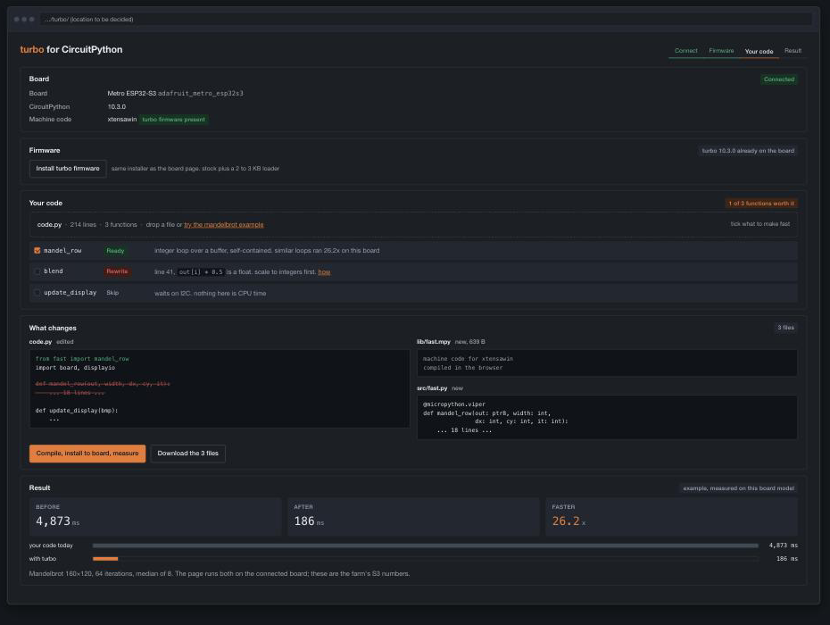

# turbo

Making CircuitPython fast with the native and viper machine-code emitters,
across boards that shipped with bytecode only.

CircuitPython already carries `@micropython.native` and `@micropython.viper`.
Nothing in the language needs to change. What is missing is a board that can
load machine code, and a tool that produces it. turbo is both halves:
firmware built with `CIRCUITPY_LOAD_NATIVE=1`, which adds a 2 to 3 KB loader
and no on-board compiler, and a host CLI that compiles your module with the
official `mpy-cross` and installs it where the importer will find it.

On the twelve boards measured so far a viper inner loop runs 19x to 72x faster
than the same code as bytecode.

## The layout it produces

The CLI never moves your files. `turbo init` creates `src/` and drops in the
shim; you move the module you want fast into `src/`. `turbo build` only reads
`src/` and writes into `lib/turbo/`. `code.py` is never touched by any command.

```
BEFORE                          AFTER  turbo init + turbo build
─────────────────────           ──────────────────────────────────────────────
CIRCUITPY/                      CIRCUITPY/
  code.py                         code.py                    unchanged, still source
  pixels.py                       lib/
                                    turbo.py                 THE SHIM (new, 49 lines)
                                    turbo/
                                      turbo.json             manifest: src sha256, sizes
                                      armv7emsp/
                                        pixels.mpy           installed winner (viper)
                                        pixels.viper.mpy     candidates kept beside it
                                        pixels.native.mpy
                                  src/
                                    pixels.py                YOU moved it here
```

Nothing else on the drive changes. `circup` copies `lib/turbo/<arch>/`
verbatim, so this ships as a normal library.

### What the tool does on the host

```
src/pixels.py
     │  @turbo.viper                    your marker, does nothing on the board
     ▼  rewrite in a temp copy          host only, your file is not edited
   @micropython.viper                   and separately @micropython.native
     │
     ▼  mpy-cross -march=armv7emsp   x2
lib/turbo/armv7emsp/pixels.viper.mpy   639 B
lib/turbo/armv7emsp/pixels.native.mpy  1,204 B
     │
     ▼  install the faster one under the plain name
lib/turbo/armv7emsp/pixels.mpy
```

### What the board does at boot

```
code.py runs (as source, always, never compiled)
  │
  ├─ import turbo ──────────► lib/turbo.py, the shim:
  │                             reads sys.implementation._mpy >> 10  ->  7
  │                             maps 7 -> "armv7emsp"
  │                             os.stat("/lib/turbo/armv7emsp")      ->  exists
  │                             inserts it, then /src, at front of sys.path
  │
  │   sys.path BEFORE:  ["", "/", ".frozen", "/lib"]
  │   sys.path AFTER:   ["/lib/turbo/armv7emsp", "/src", "", "/", ".frozen", "/lib"]
  │
  └─ import pixels ─────────► first hit: /lib/turbo/armv7emsp/pixels.mpy   ✓ machine code
```

`src/` is not on `sys.path` by default, and that is deliberate. CircuitPython
tries `name.py` before `name.mpy` in the same directory
(`py/builtinimport.c:80`), so source sitting next to a compiled file silently
wins and you never run the fast version. Hiding the source in a directory the
importer cannot see is what makes this work with no change to the importer.

Three branches, all tested on the eight-board farm, all giving checksum 407644:

| Situation | `turbo.arch` | Imports from |
|---|---|---|
| turbo firmware, arch dir built | `armv7emsp` | `/lib/turbo/armv7emsp/pixels.mpy` |
| turbo firmware, no dir for that arch | `xtensawin` | `/src/pixels.py` |
| stock firmware, no native at all | `None` | `/src/pixels.py` |

Two consequences fall out of it. Delete `pixels.mpy` and the same
`import pixels` lands on `/src/pixels.py`: slower, identical result. And
`code.py` cannot be accelerated at all, because it runs via `pyexec_file`, not
via `import` (`main.c:460`).

## A session

Verbatim from the farm Metro RP2040, 2026-09-08. Nothing but `--mount` and
`--port` was passed, and those only because the farm has eight boards attached.

```
$ turbo doctor
board       Adafruit Metro RP2040         adafruit_metro_rp2040
port        /dev/ttyACM18
drive       /media/sklarm/CIRCUITPY5
firmware    CircuitPython 10.3.0-42-g3cdb20693f
_mpy        0x1306   arch armv6m · mpy 6.3 · native loader present
            dev build of 10.3.0; using the 10.3.0 mpy-cross, abi checked below
toolchain   ~/.cache/turbo/mpy-cross/10.3.0/linux-amd64/mpy-cross   1411 KB   mpy v6.3
ready       turbo build compiles -march=armv6m

$ turbo init --example
wrote  lib/turbo.py              shim, 49 lines, identity decorators on stock firmware
made   src/                      your source, kept off sys.path so it never shadows .mpy
made   lib/turbo/armv6m/         where compiled modules land
wrote  src/pixels.py             mandelbrot, 12-bit fixed point, @turbo.viper
wrote  code.py                   imports turbo, then pixels; prints the checksum

$ turbo build
pixels     viper   armv6m       603 B      native     635 B
1 built, 1081 ms, copied 1 module, shim to /media/sklarm/CIRCUITPY5

$ turbo bench pixels
board: mpy v6.3 arch armv6m on /dev/ttyACM18
bytecode  median    8335.3 ms  value 407644
native    median    4778.0 ms  value 407644
viper     median     422.9 ms  value 407644
installed viper for armv6m (19.71x over bytecode)
```

`doctor` fetches and caches the official `mpy-cross` for your host on first
use, so there is no CircuitPython checkout and no toolchain to build. The
`value 407644` on every line is the point of `bench`: a variant whose checksum
disagrees is not a faster version of your code, it is a different program, and
it does not get installed.

The CLI lives in its own repo now, `mikeysklar/turbo-cli`, and goes to PyPI as
`adafruit-turbo` when it is ready.

## What those commands produced

| Board | Core | float bytecode | `@native` | `@viper` | viper / float |
|---|---|---|---|---|---|
| Metro M0 Express | Cortex-M0+ 48 MHz | 72,741 | 23,408 | 1,014 | 71.7x |
| Metro RP2040 | Cortex-M0+ 125 MHz | 13,942 | 4,739 | 384 | 36.3x |
| Metro M4 AirLift | Cortex-M4F 120 MHz | 11,221 | 3,536 | 431 | 26.0x |
| Feather nRF52840 | Cortex-M4F 64 MHz | 20,788 | 7,445 | 781 | 26.6x |
| Metro ESP32-S2 | Xtensa LX7 240 MHz | 7,438 | 2,110 | 206 | 36.1x |
| Metro RP2350 | Cortex-M33 150 MHz | 6,371 | 2,380 | 261 | 24.4x |
| Metro ESP32-S3 | Xtensa LX7 240 MHz | 4,873 | 1,708 | 186 | 26.2x |
| Feather STM32F405 | Cortex-M4F 168 MHz | 8,121 | 2,779 | 416 | 19.5x |
| ESP32-C5 DevKitC | RISC-V rv32imc 240 MHz | 7,591 | 1,809 | 172 | 44.0x |
| nRF54L15 DK | Cortex-M33 128 MHz | 10,233 | 2,836 | 349 | 29.3x |
| nRF54LM20 DK | Cortex-M33 128 MHz | 10,288 | 2,840 | 351 | 29.3x |
| EK-RA8D1 | Cortex-M85 480 MHz | 1,802 | 488 | 47 | 38.3x |

Mandelbrot 160x120, 64 iterations, ms, median of 8. Same checksum across
variants or the row did not count. Float bytecode speed is unchanged with the
loader in the build, under 0.1%. Full table in
[docs/turbo-on-the-farm.md](docs/turbo-on-the-farm.md).

Every number above was produced by hand, before the CLI existed. Nothing here
is proposed:

```sh
# once per CircuitPython tag: the tree's mpy-cross and a loader firmware
$ make -C mpy-cross -j4
$ make -C ports/raspberrypi BOARD=adafruit_metro_rp2350 CIRCUITPY_LOAD_NATIVE=1 -j4

# per edit: compile for the board's core, keep source off sys.path
$ ~/cp-1030/mpy-cross/build/mpy-cross -march=armv7emsp src/pixels.py \
      -o lib/turbo/armv7emsp/pixels.mpy
$ cp lib/turbo.py lib/turbo/armv7emsp/pixels.mpy src/pixels.py   -> CIRCUITPY

# the image: firmware plus project as one UF2, one drag, 13 s
$ folder2uf2 --board adafruit_metro_rp2350 --combine firmware.uf2 \
      -o turbo-demo.uf2 turbo-demo/

# prove it: 8+ trials, bytecode vs native vs viper, same checksum or it does not count
$ python3 tools/pyboard.py /dev/cu.usbmodem14201 bench.py
```

Four things a person has to know to run that: which `-march` their chip is,
that source beside `.mpy` silently wins, which `mpy-cross` matches their
firmware, and where `folder2uf2` comes from. The CLI removes three of the four.

## Get the firmware

Grab the `.uf2` for your board from the latest `cp-<version>` release, or from
the command line:

```sh
gh release download cp-10.3.0 -R mikeysklar/turbo -p '*metro_esp32s3*.uf2'
```

Every release also ships a matching `mpy-cross` for Linux and a `BUILD.txt`
per board recording the exact source commit, toolchain and flags.
[docs/build.md](docs/build.md) has the commands to build a new tag.

## Status

**ESP32-S2 and ESP32-S3 (Xtensa): working, verified on hardware.**

**ESP32-C5 (RISC-V): working, verified on hardware**, 172 ms on the same
Mandelbrot loop, 44x over float bytecode. **ESP32-C3 / C6 / P4: compiled in,
not yet run on hardware** (the P4 firmware is built and verified; flashing is
blocked by its download USB).

**Loader-only is the model (2026-09-06).** turbo compiles on the host with
`mpy-cross`, so the board needs the native `.mpy` loader and not the on-board
emitter. `CIRCUITPY_LOAD_NATIVE=1` builds that: 2 to 3 KB over stock instead
of 20 to 50 KB, same viper speed, and `@micropython.viper` from source becomes
a `SyntaxError`. All eight farm boards run it (`loader-only-native` for ARM,
`esp32-native` for Xtensa); the published releases still carry the emitter
builds until the workflow is switched. Details in
[docs/loader-only-samd.md](docs/loader-only-samd.md).

| Board | Arch | Native / viper | Source | In release |
|---|---|---|---|---|
| Metro RP2040 | Thumb (armv6m) | loader-only, no emitter | fork branch | emitter build |
| Metro RP2350 | Thumb (armv7em) | loader-only, no emitter | fork branch | emitter build |
| Feather nRF52840 | Thumb (armv7em) | loader-only, no emitter | fork branch | emitter build |
| Feather STM32F405 | Thumb (armv7em) | loader-only, no emitter | fork branch | emitter build |
| Metro M0 Express | Thumb (armv6m) | loader-only, no emitter | fork branch | not yet |
| Metro M4 AirLift | Thumb (armv7em) | loader-only, no emitter | fork branch | not yet |
| EK-RA8D1 | Thumb (armv7emdp) | works, D-cache on | fork branch | not yet |
| Metro ESP32-S2 | Xtensa LX7 | loader-only, no emitter | fork branch | emitter build |
| Metro ESP32-S3 | Xtensa LX7 | loader-only, no emitter | fork branch | emitter build |
| ESP32-C5 DevKitC | RISC-V (rv32imc) | works | fork branch | not yet |
| ESP32-C3/C6/P4 | RISC-V | untested | fork branch | not yet |

## The ESP32 firmware changes

Five commits on the `esp32-native` branch of the CircuitPython fork:

1. Select the native emitter by architecture, not just Thumb.
2. Commit native machine code into executable RAM (the GC heap is not executable).
3. Turn memory protection off when native code is enabled.
4. Make the Xtensa assembler compile under CircuitPython's warning flags.
5. Do not set the ARM Thumb interworking bit on non-ARM pointers.

The fifth was the actual bug: `MICROPY_MAKE_POINTER_CALLABLE` OR-ed the ARM
Thumb bit into every code pointer, which on Xtensa jumps to an odd address and
hard-faults on the first native call. It stayed latent because no non-ARM port
had ever enabled the native emitter.

## Arch ids

`sys.implementation._mpy >> 10`:

| id | arch | id | arch |
|---|---|---|---|
| 4 | `armv6m` | 8 | `armv7emdp` |
| 5 | `armv7m` | 9 | `xtensa` |
| 6 | `armv7em` | 10 | `xtensawin` |
| 7 | `armv7emsp` | 11 | `rv32imc` |

## What is in this repo

- `shim/turbo.py` — the on-board `@turbo` decorator (identity fallback on stock firmware).
- `cli/turbo_cli.py` — the original host tool. Active development moved to
  [mikeysklar/turbo-cli](https://github.com/mikeysklar/turbo-cli).
- `examples/mandelbrot/` — the benchmark used for the numbers above.
- `docs/` — conversion procedure, farm notes, applications, work log,
  `analyze.md`, the verdicts and what they cannot see, and `build.md`, the
  commands to run the workflow.
- `.github/workflows/firmware.yml` — builds all boards and publishes the
  release. Two jobs: `board` (ARM, stock tag) and `esp32` (fork branch). The
  ESP32 job also checks the emitter and the executable-RAM allocator are linked
  and that memory protection is off in the built sdkconfig.

See [ROADMAP.md](ROADMAP.md) for what is left.

## In progress: the same thing as a web page

The CLI serves people who live in a shell. The board pages already serve
everyone else, and they already load `adafruit/web-firmware-installer-js`.
Pointing that at turbo firmware is markup, and the rest of the flow (probe the
board over WebSerial, read a dropped `.py`, say which functions are worth
compiling, install, measure before and after on the user's own board) is the
same engine the CLI uses.

**Mockup, not a screenshot.**



A skeleton lives in `mikeysklar/turbo-web`: the WebSerial probe, the verdict
scanner and the on-board before/after are real, and the in-browser compile is
still a stub serving pre-built `.mpy` files. It also waits on public firmware
URLs, so it cannot ship before the announcement.
